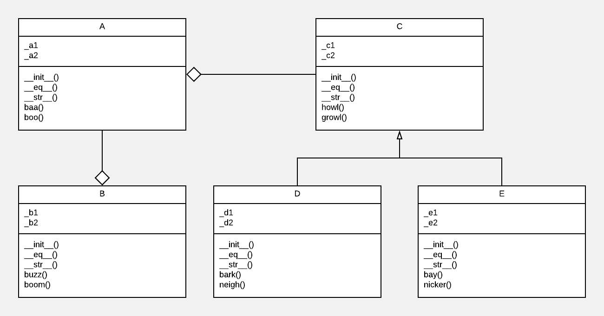

# Every problem has a solution

1. Devise an original problem that can be solved using Python and object-oriented design.

2. Describe the details of such solution.

3. Your class organization should match the one in the picture below. There must be an inheritance (e.g. classes *D* and *E* **extend** class *C*) and a composition (i.e. class *A* **has** and object of class *B*, class *C* **has** and object of class *A*).

4. Implement your classes and relevant methods in Python.

    * Implement `__init__`, `__eq__`, and `__str__` methods. It's up to you to decide whether `__init__` should take any arguments.
    * Implement all data members as *properties* (at least **2** per class). It's up to you if you want a property to be modifiable (i.e. whether or not to implement a *setter*).
    * Implement public methods (at least **2** per class). It's up to you to decide what do those methods do and what arguments (if any) they take.
    * It's up to you to decide how to name classes, data members, and methods. The diagram is provided as a reference only.

5. Write unit tests to validate your implementation. You should rename the provided test methods and use [pytest](https://docs.pytest.org/en/latest/index.html) framework.

6. Modify `__init__.py` to include your classes. See the similar files from previous assignments for inspiration.

7. Submit `__init__.py`, `customproblem.py`, and `test_customproblem.py` to KATIE.

